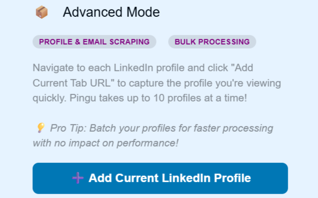
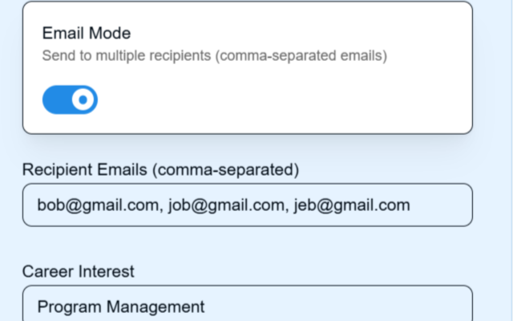

# Pingu (v2.0) - Currently in Google Chrome Webstore

Pingu is your AI-powered personal assistant for writing thoughtful, effective cold emails—fast. Built for students, job-seekers, founders, and professionals, Pingu personalizes your outreach based on profile details and intelligent web context.

🎯 With One Click, Pingu...

🌐 Scrapes recipient's LinkedIn Profile and Finds their email with one click, 

🧠 Uses Recipient's Profile For AI-Personalized Message,

✨ Instantly generates a personalized email, individually or in batches up to 50,

📧 Integrates to your Gmail, Sending the Email on Your Behalf,

🌐 All While Working seamlessly from your browser with a clean, modern UI.

Whether you’re reaching out for internships, networking or full-time, Pingu saves time while championing personalization.

Try it free with limited credits. Upgrade plans available.

Note: Prices updated. Google OAuth verification in process.
---

## Screenshots

### Extension Main UI

### Advanced Email

### Simple Email

### Example Generated Email

### Profile Settings

### Subscription/Upgrade Panel

---

For more details, see the [privacy policy](https://tkher23.github.io/pingu-privacy/)(#).
