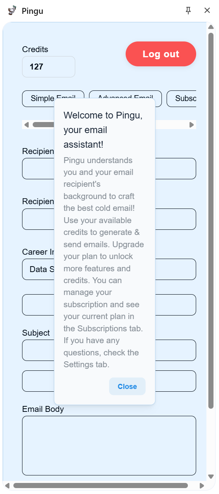
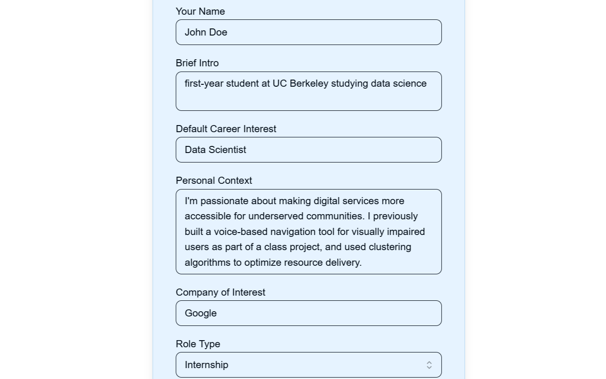
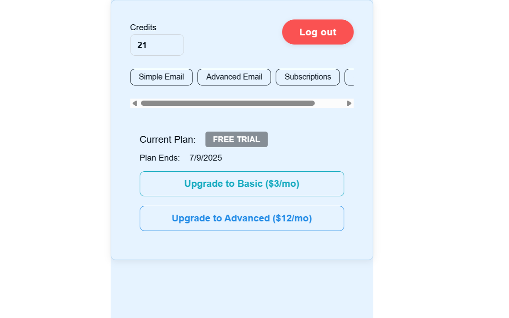
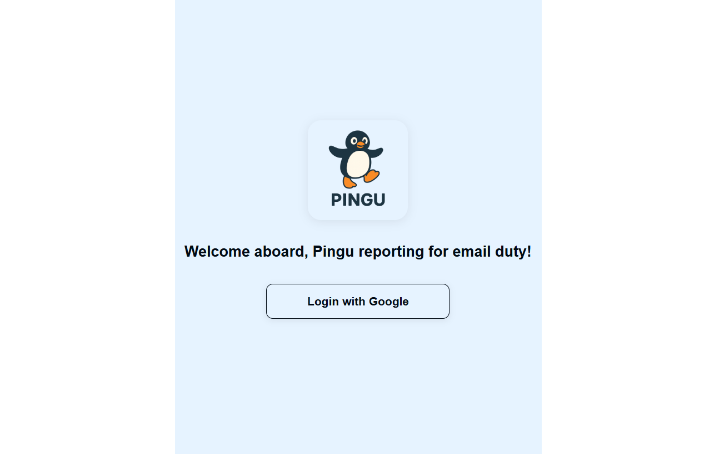
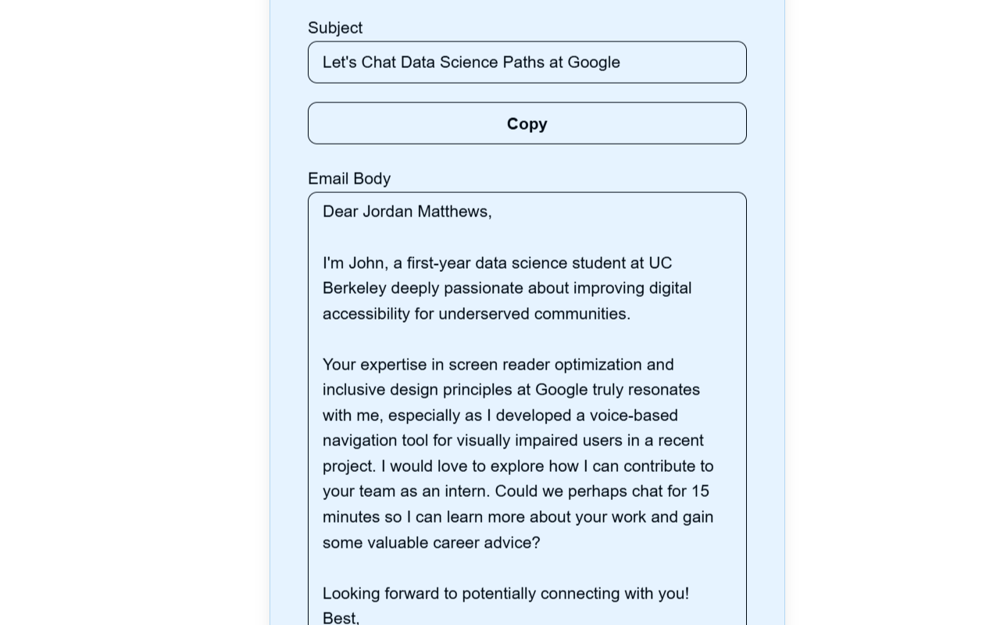

# Pingu (v1) - Currently in the Google Chrome Webstore

Pingu is your AI-powered personal assistant for writing thoughtful, effective cold emails—fast. Built for students, job-seekers, founders, and professionals, Pingu personalizes your outreach based on profile details and intelligent web context.

🎯 Features:

✨ One-click email generation from basic inputs (name, intro, recipient, interest)

🧠 AI-personalized messaging using recipient's background and company values

📧 Gmail integration for direct email sending straight from Pingu

🌐 Works seamlessly from your browser with a clean, modern UI

Whether you’re reaching out for internships, networking or full-time, Pingu saves time while championing personalization.

Try it free with limited credits. Upgrade plans available.

---

## Screenshots

### Extension Main UI

### Profile Settings

### Subscription/Upgrade Panel

### Loading State

### Example Generated Email

---

For more details, see the [privacy policy](https://tkher23.github.io/pingu-privacy/)(#).
